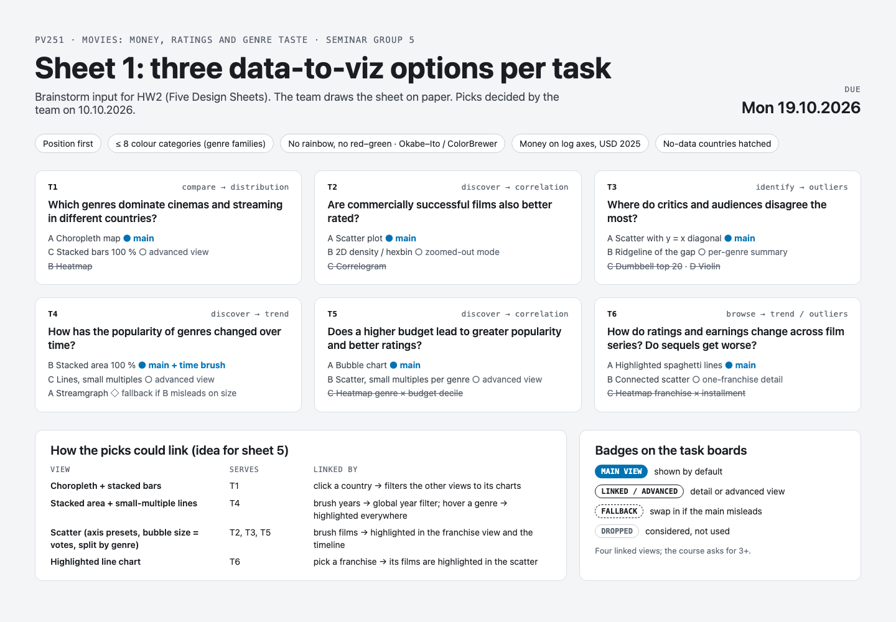
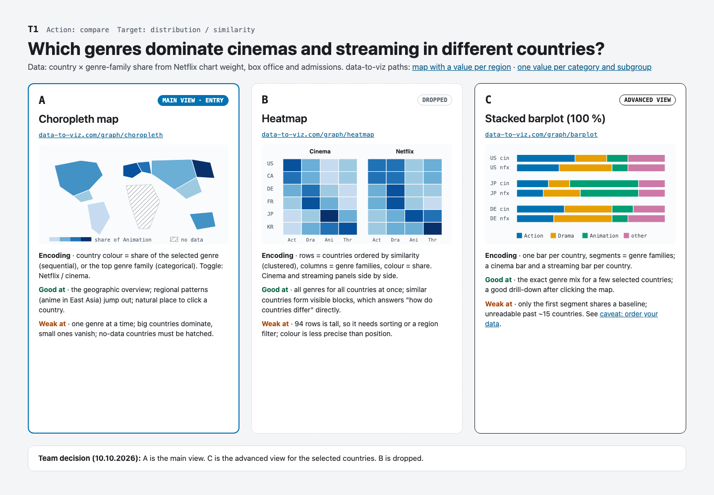
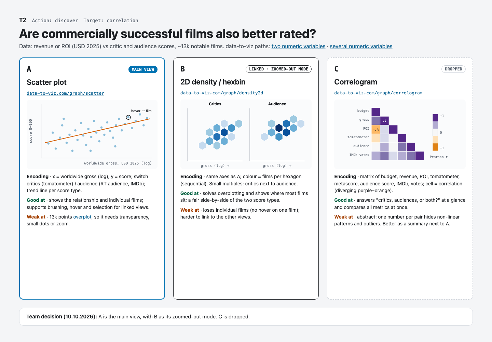
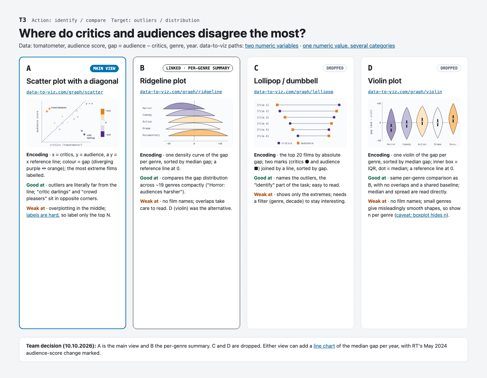
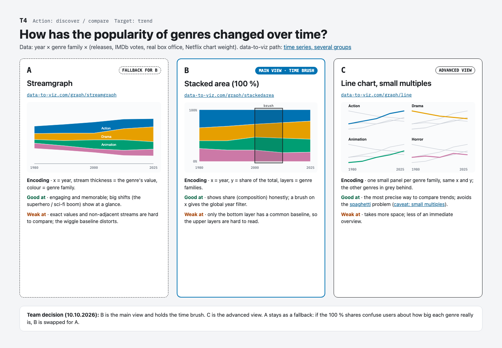
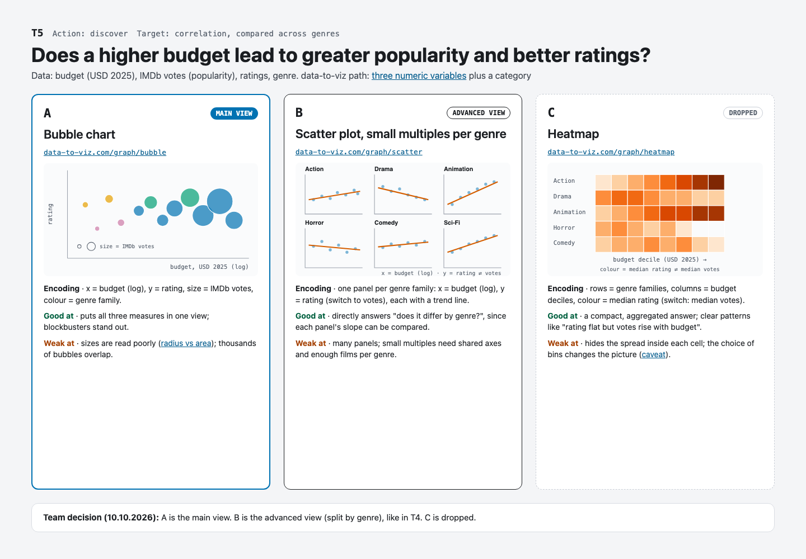
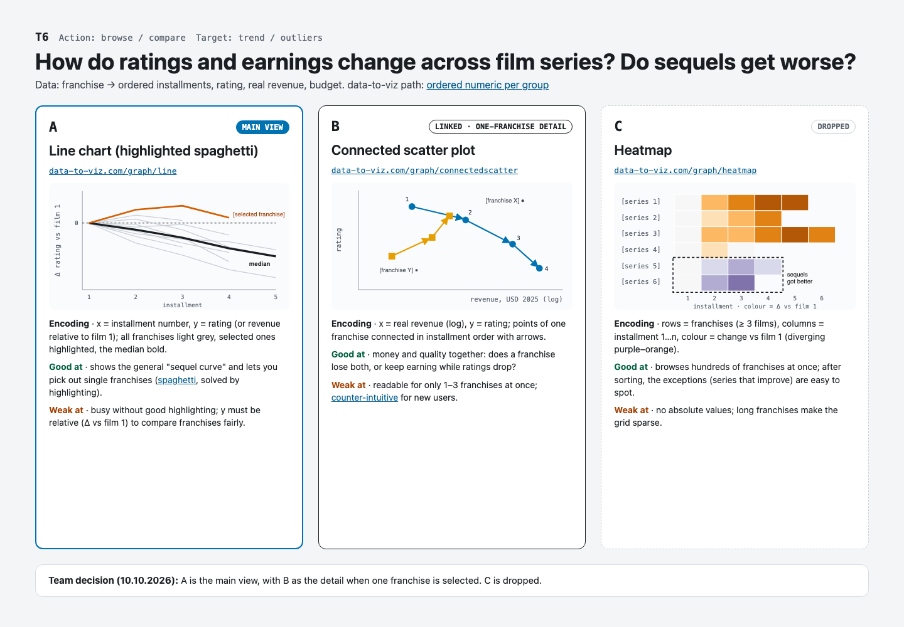

# Sheet 1 canvas

The chart options for sheet 1, one board per task, with the team's picks from
2026-10-10 (D10 in `docs/decisions.md`). Use it as the reference when drawing
sheet 1 on paper. The text version with every trade-off is
[`../sheet-1-options.md`](../sheet-1-options.md).

The PNGs below show on GitHub. To click between boards, open `index.html` in a
browser after cloning the repo.

## Overview

## T1. Genre taste per country

## T2. Money vs ratings

## T3. Critic–audience gap

## T4. Genre popularity over time

## T5. Budget vs popularity and ratings

## T6. Do sequels get worse

